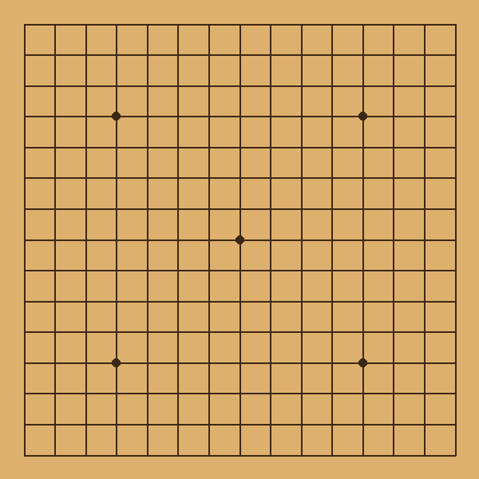
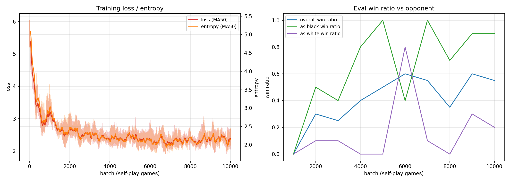

# gomoku_ai

**English** | [简体中文](README.zh-CN.md)

[](LICENSE)
[](https://www.python.org/downloads/)
[](https://en.cppreference.com/w/cpp/17)
[](https://pytorch.org/)

An AlphaZero implementation for Gomoku (Five in a Row) with a **lock-free,
massively parallel C++ MCTS** engine and a PyTorch policy-value network,
trained purely from self-play. A web UI is included so you can play against
the trained AI in your browser.

Dev log (Chinese, 4 parts): [(1) MCTS framework](https://www.douban.com/note/875904332/) ·
[(2) MCTS performance tuning](https://www.douban.com/note/876037477/) ·
[(3) 11x11 policy-value MCTS](https://www.douban.com/note/876852240/) ·
[(4) 15x15](https://www.douban.com/topic/496923907/)

## Demo

A 15x15 self-play game of the trained `model_examples/15x15_snapshots/policy_game_9000`
(400 MCTS simulations per move, well under 1 s/move on a 16-core CPU; the GIF
is generated by `scripts/record_demo_gif.py`):



Training curves of the 15x15 run (10k self-play games, evaluation against a
another MCTS opponent every 1000 games):



## Highlights

- **Lock-free parallel MCTS in C++** (`alphazero_mcts.hpp`): board state in
  two `std::bitset`s; children stored in a sorted `uint64_t` vector packed
  into a single atomic pointer (top 16 bits = ABA counter); per-node
  concurrency/visits/score packed into one 8-byte atomic; memory reclaimed
  with **hazard pointers**; **virtual loss** keeps worker threads spread
  across the tree. Exposed to Python via pybind11.
- **AlphaZero training pipeline** (`train.py`): self-play -> 8x
  rotation/flip augmentation -> policy-value update with KL-adaptive
  learning rate -> periodic evaluation against a fixed opponent, all logged
  to tensorboard.
- **Two network architectures**: v1 (3-conv,
  `policy_value_net_pytorch.py`) and v2 (ResNet,
  `policy_value_net_pytorch_v2.py`, default). v1/v2 weights are
  auto-detected from file content when loading.
- **Play in the browser**: a C++ web server (Crow + embedded Python for
  on-the-fly model conversion) serves `templates/index.html`; per-game
  settings (AI type, model, simulations, c_puct, threads, color) are
  adjustable from the UI.
- **Evaluation tools**: `elo.py` (1v1 Elo match with confidence interval)
  and `league.py` (round-robin league with ranking table and head-to-head
  score matrix).
- **Board sizes**: 8x8, 9x9 (pure MCTS), 11x11 and 15x15 (pure MCTS +
  AlphaZero).

## Performance & playing strength

Measured on a 16-core / 32 GB x86-64 server (see the dev log above for
details and screenshots).

**Pure MCTS engine**

| Version | Board | Simulations | Time per move | Notes |
|---|---|---|---|---|
| v0.1 | 8x8 | 1k | 0.01–0.05 s | single-threaded; >=20x faster than a vectorized Python version |
| v0.1 | 11x11 | 200k | 8–15 s | plays at a casual amateur level |
| v0.2 | 11x11 | 1.5M | 20–30 s | 20 threads + jemalloc: ~7x faster search, >10x faster tree reclamation; strong amateur level, reads double-threats |

**AlphaZero (policy-value net + MCTS)**

| Model | Board | Network | Self-play games | Training time | Strength |
|---|---|---|---|---|---|
| v0.3 (`11x11_snapshots/policy_game_9000`) | 11x11 | ResNet 3 blocks / 64 ch | 10k | ~20 h | 20:0 vs 1.5M-sim pure MCTS with only 10k–40k sims/move (~2 s at 10k sims); ties 500k-sim pure MCTS with just 1k sims |
| `15x15_snapshots/policy_game_9000` | 15x15 | ResNet 3 blocks / 64 ch | 10k | >24 h | 20:0 vs 1.5M-sim pure MCTS |
| `15x15_6blocks_snapshots` | 15x15 | ResNet 6 blocks / 64 ch, 2000 playouts | 10k | ~65 h | roughly ties the 3-block version at 10k sims; **very hard for a human to beat** |

Training-notes worth knowing (from the dev log):

- Model inference dominates self-play: single-threaded 10k-rollout training
  produced only 14 games in 5 hours; multithreading the rollouts is
  essential.
- Inference with a single OMP intra-op thread per worker plus BatchNorm
  folding at export gave a ~10x self-play speedup.
- Putting Dirichlet noise at node expansion instead of the root selection
  collapses training; diversity matters.

## Repository layout

```
alphazero_mcts.hpp/.cpp    # lock-free parallel MCTS core + pybind11 bindings (the gomoku_ai module)
pure_mcts.hpp              # legacy standalone pure-MCTS header, kept for reference
game.py                    # game loop (match / self-play data collection)
player.py                  # PureMCTSPlayer / AlphaZeroPlayer wrappers over the C++ engine
policy_value_net_pytorch.py    # v1 policy-value net (3 conv layers)
policy_value_net_pytorch_v2.py # v2 policy-value net (ResNet, default); arch auto-detection
train.py                   # self-play training pipeline
elo.py                     # 1v1 Elo match between two players (model or pure MCTS)
league.py                  # round-robin league between N models
plot_train_curve.py        # plot loss/entropy/eval curves from tensorboard events
web_server.cpp             # C++ web server (Crow) + embedded Python model converter
templates/index.html       # browser play UI
model_examples/            # trained model snapshots (see below)
third_party/               # Crow (web framework) and nlohmann/json
setup.py, install_plugin.sh      # build the gomoku_ai python extension
compile_web_server.sh            # build the web server
```

## Requirements

- Linux, **clang++** (required: g++ -O3 strict-aliasing miscompiles the
  pointer packing in the MCTS tree; see the note in `setup.py`), Python >= 3.9
- Python packages: `pip3 install -r requirements.txt`
- C++ libraries: libtorch (shipped with the pip `torch` package), **folly**,
  gflags, glog, fmt, libunwind, double-conversion, libiberty, libevent,
  boost-context, jemalloc, libgomp

On Debian/Ubuntu the C++ dependencies can be installed with:

```bash
apt-get install libfolly-dev libgflags-dev libgoogle-glog-dev libfmt-dev \
    libunwind-dev libdouble-conversion-dev libiberty-dev libevent-dev \
    libboost-context-dev libjemalloc-dev libgomp1
```

## Build

```bash
pip3 install -r requirements.txt

./install_plugin.sh        # builds gomoku_ai.*.so (C++ MCTS python extension)
./compile_web_server.sh    # builds ./web_server
```

Both scripts auto-detect the torch / pybind11 / python paths from the
current interpreter, so a virtualenv or a different python version just
works.

## Usage

### Play against the AI in a browser

```bash
# 11x11 with a trained snapshot (state_dict auto-converted to TorchScript):
./web_server -m model_examples/11x11_snapshots/policy_game_9000.model -n 10000

# 15x15 with the 6-block ResNet snapshots:
./web_server -s 15 -m model_examples/15x15_6blocks_snapshots/policy_game_9000.model -n 10000

# or pure MCTS without any model:
./web_server -n 1000000
```

Then open <http://localhost:7000>. AI type, model, simulation count, c_puct,
thread count and your color can all be changed per game from the web UI.
Run `./web_server --help` for all options (search threads default to the
local CPU count).

### Train from scratch

```bash
./train.py                                   # 11x11, v2 ResNet 3 blocks / 64 channels
./train.py --board-size 15 --num-blocks 6 --channels 64 --n-playout 2000
./train.py current_policy.ckpt               # resume from a checkpoint
```

Artifacts (checkpoint `current_policy*.ckpt`, exported model
`current_policy*.model`, tensorboard dir `gomoku_experiments*/`, and a
snapshot per evaluation under `<board>x<board>_snapshots/`) are suffixed per
board size, so 11x11 and 15x15 runs never overwrite each other. Evaluate
periodically against pure MCTS or a fixed model (`--opp-model`); watch the
curves with:

```bash
./plot_train_curve.py --dir ./gomoku_experiments
tensorboard --logdir ./gomoku_experiments
```

### Evaluate models

```bash
# AlphaZero model vs pure MCTS (default matchup):
./elo.py -n 20 --a-model model_examples/11x11_snapshots/policy_game_9000.model \
         --b-model= --b-simulations 500000

# model vs model:
./elo.py -n 20 --a-model a.model --b-model b.model

# round-robin league over the example snapshots:
./league.py --games 10 --models=$(ls model_examples/11x11_snapshots/*.model | tr '\n' ',')
```

### Use the engine from Python

```python
import torch        # must be imported before gomoku_ai (see the note in elo.py)
import gomoku_ai

# Pure MCTS on an 11x11 board, one worker thread per CPU core:
game = gomoku_ai.PureMCTSFramework11(cores=16, c_puct=2.0, reuse_tree_states=True)
move = game.SearchBestMove(simulate_times=100000)   # -> (x, y)

# AlphaZero MCTS (TorchScript model):
game = gomoku_ai.AlphaZeroMCTSFramework15(cores=16, c_puct=5.0, reuse_tree_states=True)
moves, probs = game.SearchBestMove(simulate_times=1000, model_path='model.pt', temperature=1.0)
```

Binding classes are named `PureMCTSFramework{8,9,11,15}` and
`AlphaZeroMCTSFramework{8,11,15}`.

## Model examples

Pretrained snapshots (one per 1000 self-play games) are under
`model_examples/`:

| Directory | Board | Network | Note |
|---|---|---|---|
| `11x11_snapshots/` | 11x11 | ResNet 3 blocks / 64 ch | `policy_game_9000` is the strongest of the run |
| `15x15_snapshots/` | 15x15 | ResNet 3 blocks / 64 ch | `policy_game_9000` beats 1.5M-sim pure MCTS 20:0 |
| `15x15_6blocks_snapshots/` | 15x15 | ResNet 6 blocks / 64 ch | trained with 2000 playouts/move; the strongest series |

All of them are PyTorch `state_dict`s (`.model`); `elo.py`, `league.py` and
`web_server` convert them to TorchScript automatically at load time.

## Acknowledgements

- [junxiaosong/AlphaZero_Gomoku](https://github.com/junxiaosong/AlphaZero_Gomoku) --
  the reference implementation this project grew from
- [Crow](https://github.com/CrowCpp/Crow) and
  [nlohmann/json](https://github.com/nlohmann/json) (vendored under
  `third_party/`), [Folly](https://github.com/facebook/folly),
  [LibTorch](https://pytorch.org/), [pybind11](https://github.com/pybind/pybind11)
- Papers: *Mastering the game of Go without human knowledge* (AlphaGo Zero)
  and *Mastering Chess and Shogi by Self-Play with a General Reinforcement
  Learning Algorithm* (AlphaZero)

## License

[MIT](LICENSE)
